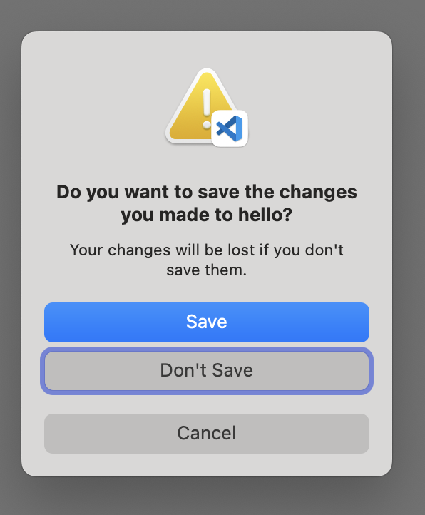

# Mac Setup Guide for OCD

## How to Configure an Efficient Mac Working Environment

[Chinese Version](https://github.com/macdao/ocds-guide-to-setting-up-mac/blob/master/README.md)

The initial version of this document was written in 2015, when I was using a 2013 MacBook Pro with OS X El Capitan 10.11. For nostalgia, you can check the [2015 Version](https://github.com/macdao/ocds-guide-to-setting-up-mac/tree/2015).

Later in 2019, I got a 2019 MacBook Pro with macOS Catalina 10.15. I deliberately did not restore from Time Machine but set it up from scratch. When I followed this guide, I found that many things had changed. The content from that time is in the [2019 Version](https://github.com/macdao/ocds-guide-to-setting-up-mac/tree/2019).

Now in 2024, I have upgraded to an M3 Max MacBook Pro with macOS Sonoma 14, and many new contents have been added this time.

## Table of Contents

You can open the index by clicking the menu icon in the top-right corner of GitHub.

## Why this document

I've always wanted to write this article to share the experience I've learned from my colleagues. Although there are already many excellent books from which I've learned a lot, I still want to share my own experience.

In projects, I usually work with 1 to 10 people, often pairing by sharing the same laptop with an external display, mouse, and keyboard. I mostly work with Java, Ruby, Node.js, Web, etc., and use a lot of software from [JetBrains](https://www.jetbrains.com/), such as IntelliJ IDEA, RubyMine, WebStorm, etc.

I know my knowledge is limited, so I'm sharing this article to get your opinions. As more efficient methods and better tools keep emerging, I'll keep updating this article to collect the better methods and tools here—it's my greedy wish. For the latest version, please visit: <https://github.com/macdao/ocds-guide-to-setting-up-mac>. Issues or Pull Requests are welcome. Looking forward to your feedback.

In my opinion, an efficient Mac environment has the following characteristics:

- Automation

  For example, manually installing an application requires: 1) opening your browser, 2) searching for the application name, 3) opening the application's official website, 4) finding the download link and installation method, 5) downloading and waiting for the download to complete, 6) installing the downloaded file, 7) possibly some subsequent installation steps. Whereas automating the installation of an application only requires: 1) opening the terminal tool, 2) typing the installation command, 3) waiting for completion.

  Automation can greatly simplify operations and improve efficiency.

- Consistency

  I often pair-program and occasionally encounter different shortcuts or commands. I strongly recommend that, at least within a team, everyone tries to use the same shortcuts, commands, and environment. (I remember there's a practice for this, but I haven't found its name and source—please let me know if you do.)

  Also, for the sake of consistency, I prioritize default configurations. I only adopt custom configurations when the default ones are significantly worse.

- Sufficiency

  "Good enough" is perfect. If the system itself meets my needs, I won't use third-party tools.

- Efficiency

  Efficiency—everything is for efficiency.

*For third-party applications, only the simplest installation and usage instructions are provided; please refer to the official website and related documents for details.*

*Some sections are marked with [OCD], indicating they reflect strong personal preferences. If you share similar preferences, feel free to refer to them; if not, please ignore them.*

*PS: Although this document is titled "OCD," it doesn't refer to [OCD in the clinical sense](https://en.wikipedia.org/wiki/Obsessive%E2%80%93compulsive_disorder). Clinically, OCD is a disorder that negatively impacts a patient's daily life.*

## 1. macOS

Settings related to the macOS operating system itself.

### Set Trackpad to Tap to Click

By default, you need to physically press the trackpad to click. I prefer to set it to tap to click:
Select [System Settings] > [Trackpad], check [Tap to click] in the [Point & Click] tab.

### Three-Finger Drag

I'm used to dragging windows with three fingers. Setup: Select [System Settings] > [Accessibility] > [Pointer Control] > [Trackpad Options], check [Use trackpad for dragging], and select [Dragging style] > [Three Finger Drag].

After setting, you can also use three-finger drag to select text.

### Function Keys

By default, F1-F12 are special function keys, like adjusting screen brightness. When you need to input F1-F12 (e.g., using IntelliJ IDEA shortcuts), you need to press Fn at the same time. This is not convenient for developers.

To change F1-F12 to standard function keys: Select [System Settings] > [Keyboard] > [Keyboard Shortcuts] > [Function Keys], check [Use F1, F2, etc. keys as standard function keys].

PS: This setting doesn't seem to work on models with Touch Bar.

### Full Keyboard Control

When you close files in Code, you might encounter this dialog:


Notice that the [Save] button is different from the other two; it's blue. This type of button is called a default button, which can be triggered by clicking or by pressing the Enter key.

So, if you don't want to save and want to click [Don't Save], do you have to use the mouse? Not necessarily. There are several keyboard-based ways:

1.  **Enable Full Keyboard Access**
    Go to [System Settings] > [Keyboard] and enable [Keyboard navigation]. The dialog will then look like this:
    
    The [Don't Save] button now has a blue border, indicating it has focus. You can trigger it with the `Space` bar. You can also use the `Tab` key to move the focus between buttons.

2.  **Use Specific Shortcuts**
    - `Command-Delete`: In dialogs with a "Delete" or "Don't Save" button, this shortcut will usually trigger that option directly.
    - `Esc`: This is equivalent to clicking the [Cancel] button.

<details>
<summary>A Personal Rant on Command-D and Other Shortcuts</summary>

Besides the methods above, there's another way! Press `Command-D`! It's said that pressing `Command-<button's first letter>` can trigger the button. But! I tried `Command-C` and `Command-S` to cancel and save, but they didn't work! However, `Command-D` works! If that were all, it would be fine, but I also tried TextEdit, where closing an unsaved file shows a dialog with three buttons: [Delete], [Cancel], and [Save]. Yet `Command-D` and `Command-C` don't work, but `Command-S` can save! I completely don't understand! I'm almost going crazy, so I wrote this in a ranting tone. If anyone can explain, please tell me, I'll be very grateful!

`Command-C` probably doesn't work because it's bound to the copy function; and `Command-D` doesn't work in some cases because its function is to select the Desktop folder in "Open" or "Save" dialogs.
</details>

### Input Method Shortcuts

I always use the system's built-in Pinyin input method.

Since JetBrains IDEs like IntelliJ IDEA, WebStorm, etc., use `Control-Space` as the shortcut for auto-completion, which is the most commonly used function, this conflicts with the input method switching shortcut. I don't recommend changing the IDE shortcuts, so I suggest changing the input method shortcuts. Since macOS already uses `Caps Lock` to switch input methods by default, which is very convenient, I suggest releasing the `Control-Space` shortcut.

Select [System Settings] > [Keyboard] > [Keyboard Shortcuts] > [Input Sources], uncheck [Select the previous input source] and [Select next source in input menu].

Initially, I used `Caps Lock` to switch input methods, but found it sometimes not sensitive enough. Later, I found that setting the `Function key` as the input method switch works better. To maintain habit, I map the `Caps Lock` key to `Function key`, thus improving switch success rate.

First, set the `Function key` to switch input methods: Select [System Settings] > [Keyboard], set `Press 🌐 key to` to `Change Input Source`.

Then map `Caps Lock` to `Function key`: Select [System Settings] > [Keyboard] > [Keyboard Shortcuts] > [Modifier keys], set `Caps Lock key` to `🌐 Globe`.

### Double Pinyin Input Method

Since February 2020, I started using Double Pinyin input method, replacing the Full Pinyin I used for years. Similar to Full Pinyin (the most common "Pinyin input method"), Double Pinyin is an efficient input method based on Pinyin. It maps the initial and final of Pinyin to specific keys, so each character requires only two keystrokes, one for initial and one for final. Like Full Pinyin, mainstream input method software supports Double Pinyin.

For more information, you can refer to my article [Double Pinyin: An Efficient Pinyin Input Method You Can Master in One Day](https://zhuanlan.zhihu.com/p/106941572).

### Other Shortcuts

Using more keyboard and shortcuts, and less mouse and trackpad, can greatly improve efficiency.
- [Mac keyboard shortcuts](https://support.apple.com/en-us/HT201236)

  Apple official documentation. When coding, how to move cursor to line start, line end, page up, or move left one word? It's all in this document. I commonly use lock screen for bathroom break: `Control-Command-Q`, switch between windows in current App: ``Command-Grave Accent (`)``.
- [Keyboard shortcuts in Terminal on Mac](https://support.apple.com/guide/terminal/keyboard-shortcuts-trmlshtcts/mac)

### Voice

macOS has built-in speech function, you can use the `say` command to make Mac speak:

```sh
say hello
```

You can combine it with `&&` or `;` to notify when a task is complete:

```sh
brew update && brew upgrade && brew cleanup ; say mission complete
```

Listening through command line is a bit cumbersome. Actually, we can almost anywhere select a word and use shortcut `Option-Esc` to speak. Just need to set: Select [System Settings] > [Accessibility] > [Spoken Content], check [Speak selection].

### Dictionary

macOS has a built-in Dictionary. You can almost in any application press firmly on the trackpad to see the definition of a word. If you prefer three-finger tap, you can set it in [System Settings] > [Trackpad], in [Point & Click] tab, select [Look up & data detectors] > [Tap with Three Fingers].

You can also open the Dictionary app to look up words.

You can add English-Chinese and Chinese-English dictionaries in the Dictionary app.

### Dock Position

By default, Dock is at the bottom of the screen. Our screens are usually 16:10, so Dock at the bottom takes up vertical space that's already limited. Recommended to put Dock on the right or left.

Select [System Settings] > [Desktop & Dock], choose different positions in [Position on screen]. I personally prefer on the right.

### Keychain Access

Keychain Access is a macOS application. For me, its main function is to view saved accounts and passwords, including Wi-Fi passwords.

PS: Now you can view Wi-Fi passwords in [System Settings] > [Wi-Fi] > [Advanced], and view saved website passwords in [System Settings] > [Passwords].

### Efficient Cursor

By default, the cursor blink and move speed is quite slow. When you need to delete large paragraphs with backspace, it's painful because even holding backspace, the cursor moves slowly.

Adjust cursor speed: Select [System Settings] > [Keyboard], move the [Key repeat rate] and [Delay until repeat] sliders to the rightmost, to speed up continuous input and initial repeat, enjoy flying speed now.

### Safari Open All Windows from Last Session

I often open multiple windows in the browser. If accidentally closed (e.g., browser update), the windows are lost, which affects work. You can set the browser to automatically open all windows from the last session. Select Safari's [Settings] > [General] > [Safari opens with] > [All windows from last session].

### Check Charging Power

If you want to know the current charging power, you can use this command:

```sh
system_profiler SPPowerDataType | grep Wattage -C 5
```

You can see content like:

```
    AC Charger Information:

      Connected: Yes
      ID: 0x0000
      Wattage (W): 60
      Family: 0xe000400a
      Charging: No
```

### Activity Monitor

Activity Monitor's default Dock icon is static. You can set it to show CPU curve to real-time monitor machine load.

Right-click (two-finger click) on Activity Monitor icon in Dock, select [Dock Icon] > [Show CPU History].

### Show Date on Menu Bar

I like to show the date on the menu bar, so I can easily see the current date. Now it's default, no need for additional setup. The setting is in [System Settings] > [Control Center] > [Clock Options].

### Spotlight Shortcuts

Spotlight's shortcut (whether English or Chinese version) has been unified to `Command-Space`, no modification suggestion here.

### Create Case-Sensitive Workspace

> **Note**: This section is from an older version of the guide and has not been recently verified. The information may be outdated.

In multi-person project development, because Mac file system is case-insensitive by default, there are often weird issues. Create a case-sensitive workspace to avoid these problems:

```sh
hdiutil create -type SPARSE -fs 'Case-sensitive Journaled HFS+' -size 100g -volname workspace ~/Documents/workspace.dmg.sparseimage
```

You can mount the image in three ways:

- Double-click to open `~/Documents/workspace.dmg.sparseimage`
- `open ~/Documents/workspace.dmg.sparseimage`
- `hdiutil attach ~/Documents/workspace.dmg.sparseimage`

### Remove all Dock icons [OCD]

By default, Dock is occupied by a bunch of system apps, most of which I rarely use. When I open several frequently used apps, there are many icons on Dock, each becomes very small. So I delete all static icons on Dock, so only open apps are on Dock.

PS: Finder icon cannot be removed.

Besides deleting one by one, you can use this command to hide all static icons:

```sh
defaults write com.apple.dock static-only -bool true; killall Dock
```

PS: The `Downloads` folder on Dock will also be hidden.

How to recover (the method of only changing `static-only` doesn't work anymore):

```sh
defaults delete com.apple.dock; killall Dock
```

PS: This method will reset all Dock configurations, including Dock Position.

### Reset Launchpad Icon Order [OCD]

After new apps are installed, they often go to the first screen of Launchpad, so their position depends on installation order. I prefer them to be in a more stable order, like the system default order:

```sh
defaults write com.apple.dock ResetLaunchPad -bool true; killall Dock
```

In the default order, only Apple's own apps are on the first screen of Launchpad.

After I updated to macOS 15.2, the above command became invalid. I [found](https://forums.macrumors.com/threads/macos-15-2-launchpad-default-layout.2445232/) this command:

```sh
find 2>/dev/null /private/var/folders/ -type d -name com.apple.dock.launchpad -exec rm -rf {} +; killall Dock
```

This command finds folders named `com.apple.dock.launchpad` in `/private/var/folders/` and deletes them.

## 2. Common Tools

This section introduces some commonly used third-party applications and their settings, which may not be directly related to development.

### [Homebrew](http://brew.sh)

Package management tool, officially called "The missing package manager for macOS".

Official installation command:

```sh
/bin/bash -c "$(curl -fsSL https://raw.githubusercontent.com/Homebrew/install/HEAD/install.sh)"
```

PS: Installing Homebrew will automatically download and install Apple's Command Line Tools.

After installation, Homebrew suggests adding this line to `~/.zprofile`: `eval "$(${HOMEBREW_PREFIX}/bin/brew shellenv)"`. If you use [Oh My Zsh](#oh-my-zsh), you can use the `brew` plugin instead. Edit `~/.zshrc`, add `brew` in the `plugins=(git)` parentheses, e.g., `plugins=(git brew)`.

With Homebrew, to download tools like Wget, Gradle, Maven, etc., you don't need to download them separately from the web, just one command:

```sh
brew install wget gradle maven
```

Executing `install` commands often involves updates, which can be slow. You can disable auto-update by setting the environment variable `HOMEBREW_NO_AUTO_UPDATE`:

```sh
echo export HOMEBREW_NO_AUTO_UPDATE=1 >> ~/.zprofile
```

Want to know what tools other people in the world like to use? Check the [download rankings here](https://formulae.brew.sh/analytics/) to see which applications and tools are the most popular.

Alternatives to Homebrew include [MacPorts](https://www.macports.org/), which I haven't used.

#### Install Homebrew Using China Mirror

Sometimes accessing GitHub from within China is very slow, causing Homebrew installation to fail. I previously provided a [method](https://github.com/macdao/ocds-guide-to-setting-up-mac/tree/2019#%E4%BD%BF%E7%94%A8%E5%9B%BD%E5%86%85%E9%95%9C%E5%83%8F%E5%AE%89%E8%A3%85-homebrew), but now Homebrew supports [installation using domestic sources](https://docs.brew.sh/Installation#git-remote-mirroring).

```sh
export HOMEBREW_BREW_GIT_REMOTE="https://mirrors.ustc.edu.cn/brew.git"
export HOMEBREW_CORE_GIT_REMOTE="https://mirrors.ustc.edu.cn/homebrew-core.git"
export HOMEBREW_BOTTLE_DOMAIN="https://mirrors.ustc.edu.cn/homebrew-bottles"
/bin/bash -c "$(curl -fsSL https://mirrors.ustc.edu.cn/misc/brew-install.sh)"
```

The `HOMEBREW_BOTTLE_DOMAIN` setting allows the `ruby` download during installation to use the mirror. Refer to [Homebrew Source Usage Help](https://mirrors.ustc.edu.cn/help/brew.git.html).

Then, to make the mirror persist, add the following to your `~/.zprofile` file:

```sh
export HOMEBREW_BREW_GIT_REMOTE="https://mirrors.ustc.edu.cn/brew.git"
export HOMEBREW_CORE_GIT_REMOTE="https://mirrors.ustc.edu.cn/homebrew-core.git"
export HOMEBREW_BOTTLE_DOMAIN="https://mirrors.ustc.edu.cn/homebrew-bottles"
export HOMEBREW_API_DOMAIN="https://mirrors.ustc.edu.cn/homebrew-bottles/api"
```

The `HOMEBREW_API_DOMAIN` sets the package installation information address to the mirror address. For details, refer to [brew(1)](https://docs.brew.sh/Manpage), [4.0.0](https://brew.sh/2023/02/16/homebrew-4.0.0/).

### [Homebrew Cask](https://github.com/Homebrew/homebrew-cask)

Homebrew Cask allows you to install macOS applications using the command line. For example, you can install Chrome: `brew install --cask google-chrome`. Also Evernote `evenote`, Sublime Text `sublime-text`, VirtualBox `virtualbox`, Docker `docker`, Firefox `firefox`, Visual Studio Code `visual-studio-code`, etc., can be installed with Homebrew Cask.

Homebrew Cask is community-driven. If you find that an application on Homebrew Cask is not the latest version or missing an application you need, you can submit a pull request.

Currently, Homebrew Cask is deeply integrated with Homebrew and does not need to be installed separately.

Applications can also be installed via the App Store, and some applications can only be installed through the App Store, such as Xcode and other Apple applications. The App Store does not have a corresponding command-line tool and requires an Apple ID, which is somewhat inconvenient, but updates are very convenient.

Almost all commonly used applications can be installed via Homebrew Cask, and they are usually downloaded from official sources. Therefore, it is recommended to prioritize Homebrew Cask when installing new applications. If you are unsure of the application ID, you can use the `brew search` command to search.

#### Install Homebrew Cask Using China Mirror

According to the method described above in [Install Homebrew Using Domestic Mirror](#install-homebrew-using-domestic-mirror), after setting up, Cask can also use the mirror.

### [iTerm2](https://iterm2.com/)

iTerm2 is the most commonly used terminal application, a replacement for the Terminal application. It provides [a set of practical features](https://iterm2.com/features.html) including `Split Panes`. Its default black background makes me abandon the built-in Terminal without hesitation.

Installation:

```sh
brew install --cask iterm2
```

Thanks to Homebrew Cask, we can automatically install iTerm2 via command line.

At this point, the Terminal application has completed its mission, and subsequent command-line operations will be handled by iTerm2.

In the terminal, besides using shortcuts like `Control-E` (see [Other Shortcuts](#other-shortcuts)), you can also use shortcuts like `Option-B`, `Option-F` (for details, refer to [here](http://ss64.com/bash/syntax-keyboard.html)). The prerequisite is to set it up like this:

Select [Settings] > [Profiles], select the Profile you are using (default is `Default`), in the [Keys] tab, set both [Left Option key:] and [Right Option key:] to [Esc+].

When opening new windows/tabs, by default you enter the `$HOME` directory and need to manually switch to the working directory. If you want new windows to automatically enter the working directory, you can set it up as follows:

Select [Settings] > [Profiles], select the Profile you are using (default is Default), in the [General] tab, select [Working Directory] > [Reuse previous session's directory].

In iTerm2, double-clicking will automatically select the corresponding word, triple-clicking will select the entire line. The selected content will automatically enter the clipboard, no need to press `Command-C` to copy.

I often use iTerm2's built-in password manager to manage some passwords used in the terminal. Open it in iTerm2's [Window] > [Password Manager] (or shortcut `Command-Option-F`).

Timestamps feature can display the time of each line output in the terminal. One-time use: [View] > [Show Timestamps], default use: [Settings] > [Profiles] > [Session] > [Show timestamps] -> [Always].

### [Oh My Zsh](http://ohmyz.sh)

By default, Bash (Catalina already uses Zsh by default) is black and white, without colors. Oh My Zsh can bring you into the colorful era. Oh My Zsh also provides a set of plugins and tools that can simplify command-line operations. Later we will see many introductions, and you'll see I love this guy to death.

Official installation command:

```sh
sh -c "$(curl -fsSL https://raw.githubusercontent.com/ohmyzsh/ohmyzsh/master/tools/install.sh)"
```

For domestic users, you can use [the following method](https://github.com/ohmyzsh/ohmyzsh/wiki#welcome-to-oh-my-zsh):

```sh
sh -c "$(curl -fsSL https://install.ohmyz.sh)"
```

Currently, I use the following plugins: `git z history brew asdf`

Oh My Zsh uses Z shell (Zsh), a shell similar to Bash, but not Bash.

Oh My Zsh has many [valuable plugins](https://github.com/robbyrussell/oh-my-zsh/wiki/Plugins-Overview).

Alternatives include [Oh My Fish](https://github.com/oh-my-fish/oh-my-fish) based on [fish shell](https://fishshell.com/), and [Oh My Bash](https://github.com/ohmybash/oh-my-bash) based on Bash.

### Command Completion

Z shell supports command completion, and Oh My Zsh enables it by default. Now when you type `curl -` in the terminal and press the `Tab` key, you can see various candidate parameters:

```
--data         -d  -- HTTP POST data
--fail         -f  -- Fail fast with no output on HTTP errors
...
```

Press the `Tab` key again and you can also select parameters using the arrow keys.

When we view tool information through Homebrew, for example `brew info colima`:

```
==> Caveats
zsh completions have been installed to:
  /usr/local/share/zsh/site-functions
...
```

This indicates that the tool comes with command completion configuration, which can be used directly after installation through Homebrew. For example, typing `colima ` in the terminal and pressing the `Tab` key will show various candidate parameters:

```
completion  -- Generate completion script
delete      -- delete and teardown Colima
...
```

However, if you are using an Apple silicon computer, this is not enough. Please refer to [brew Shell Completion](https://docs.brew.sh/Shell-Completion). In short, Z shell enables command completion through the `compinit` command, which will traverse the directories in the `$fpath` variable and load the command completion configurations within them. For Intel computers, Homebrew will install command completion configurations to the `/usr/local/share/zsh/site-functions` directory, which is also the default `$fpath` for Z shell. But for Apple silicon computers, Homebrew's directory becomes `/opt/homebrew/share/zsh/site-functions`, so we need to configure it ourselves by adding the following content to the `~/.zprofile` file:

```sh
FPATH="/opt/homebrew/share/zsh/site-functions:${FPATH}"
```

Many articles recommend [zsh-completions](https://github.com/zsh-users/zsh-completions), but it is not an essential component for command completion. This repository contains common command completion configurations not included with Homebrew (such as `mvn`, `yarn`), which you can install yourself if needed.

### Git Common Aliases

To improve efficiency, many people use Git aliases, such as using `git st` instead of `git status`. However, this usually requires manual setup, and each person's configuration varies.

Oh My Zsh provides a set of system aliases to achieve the same functionality, for example, `gst` is an alias for `git status`. The Git plugin is enabled by default, meaning that using Oh My Zsh gives you a set of efficient and universally common aliases. Here are some of my commonly used aliases:

Alias | Command
----- | -------
gapa  | `git add --patch`
gc!   | `git commit --verbose --amend`
gcl   | `git clone --recurse-submodules`
gclean| `git clean --interactive -d`
gcm   | `git checkout $(git_main_branch)`
gcmsg | `git commit --message`
gco   | `git checkout`
gd    | `git diff`
gdca  | `git diff --cached`
glola | `git log --graph --pretty="%Cred%h%Creset -%C(auto)%d%Creset %s %Cgreen(%ar) %C(bold blue)<%an>%Creset" --all`
gp    | `git push`
grbc  | `git rebase --continue`
gst   | `git status`
gpr   | `git pull --rebase`
gwip  | `git add -A; git rm $(git ls-files --deleted) 2> /dev/null; git commit --no-verify --no-gpg-sign --message "--wip-- [skip ci]"`

The full list is available at: <https://github.com/ohmyzsh/ohmyzsh/tree/master/plugins/git/>.

### [Deprecated] ShiftIt

> **Note**: This tool is no longer maintained and does not work on macOS 12+. The recommended alternative is [Hammerspoon ShiftIt](#hammerspoon-shiftit).

Native macOS only supports manually resizing windows, so a window management tool is needed. I've tried many tools, but most conflict with existing shortcuts (especially IntelliJ IDEA). ShiftIt is one of the few window management tools without conflicts:

```sh
brew install --cask shiftit
```

An alternative is SizeUp, which shares the same main shortcuts as ShiftIt.

Of course, if you like hacking, [Slate](https://github.com/jigish/slate) is a good hackable window management tool. Configuration reference: <http://thume.ca/howto/2012/11/19/using-slate/>.

Recently, I researched [Rectangle](https://rectangleapp.com/), which ranks high on the Homebrew leaderboard, and found that its default shortcuts conflict with [IntelliJ IDEA](https://resources.jetbrains.com/storage/products/intellij-idea/docs/IntelliJIDEA_ReferenceCard.pdf).

### [Hammerspoon ShiftIt](https://github.com/peterklijn/hammerspoon-shiftit)

A method based on [Hammerspoon](https://www.hammerspoon.org/) that simulates Shiftit window management functionality. The installation steps are slightly cumbersome. See the title link for installation instructions.

If the `ShiftIt spoon` in [Step 2](https://github.com/peterklijn/hammerspoon-shiftit?tab=readme-ov-file#step-2) cannot be downloaded, you can use this [link](https://github.com/peterklijn/hammerspoon-shiftit/releases/download/v1.1/ShiftIt.spoon.zip), the file is exactly the same.

### z

After opening a new terminal, how do you quickly get to your project working directory? Besides `cd xxx`, `Control-R`, or using aliases, there is a more convenient way.

The [z](https://github.com/rupa/z) tool can help you quickly navigate to directories. For example, running `z cask` on my Mac will take me to `/usr/local/Homebrew/Library/Taps/homebrew/homebrew-cask`.

This tool is easy to install and requires no additional downloads because it is already integrated into Oh My Zsh. Simply edit the `~/.zshrc` file, add `z` to the `plugins=(git)` line (e.g., `plugins=(git z)`), and then run `source ~/.zshrc` to reload the configuration file to start using it.

Alternatives include autojump. autojump needs to be installed using Homebrew.

### [Vimium](https://vimium.github.io/)

Vimium is a browser extension that supports pure keyboard operation, significantly improving browser efficiency.

Installation methods can be found on the official website. Supports Chrome, Edge, Firefox.

### Installing Fonts

I often use some open-source fonts, such as `Open Sans`. Previously, I would search and download fonts from the web, then used [SkyFonts](https://www.monotype.com/products/skyfonts) to install fonts, until I discovered [homebrew-cask-fonts](https://github.com/Homebrew/homebrew-cask-fonts):

```sh
brew tap homebrew/cask-fonts
brew install font-open-sans
```

### Battery Charging Management

> **Note**: The previously recommended `bclm` tool no longer works on recent versions of macOS.

To extend battery lifespan (health), a common strategy is to keep the charge level within a certain range (e.g., 45% to 75%) rather than doing full 0-100% cycles. For more details, you can refer to studies on battery health, like [this video (in Chinese)](https://www.bilibili.com/video/BV1Ha411F7rg/?share_source=copy_web).

Setting the charging limit to around 80% is an effective method. The currently recommended command-line tool for this is [batt](https://github.com/charlie0129/batt).

```sh
brew install batt
```
After installation, you need to start the service with `sudo brew services start batt`.

For users who prefer a graphical interface, [AlDente](https://apphousekitchen.com/) is a more powerful alternative. One minor drawback is that AlDente occupies space in the Menu Bar, which can be tight on notched MacBook Pro models.

### [totp-cli](https://github.com/yitsushi/totp-cli)

I often need to enter some 2FA verification codes, which requires opening a mobile app to copy a 6-digit number. If I can complete this directly on my laptop, it would be much more convenient.

`totp-cli` is a TOTP tool that runs on the computer and can generate verification codes via the command line. In addition, it can encrypt and save keys, manage multiple sets of keys, and import/export. Previously, I used `oathtool`, managed keys myself (I put them in Keychain), and had to write scripts. Now I have switched to `totp-cli`.

```sh
brew install totp-cli
```

### Visual Studio Code

I now use Visual Studio Code more often. Visual Studio Code also has Homebrew Cask automatically create the `code` link, and also has Oh My Zsh plugin support.

```sh
brew install --cask visual-studio-code
```

### Sublime Text 3

> **Note**: This section is from an older version of the guide and has not been recently verified. The information may be outdated.

Installation:

```sh
brew install --cask sublime-text
```

Opening files with Sublime Text from the command line is a very common feature. Generally, we would follow [OS X Command Line](https://www.sublimetext.com/docs/3/osx_command_line.html) and run `ln -s "/Applications/Sublime Text.app/Contents/SharedSupport/bin/subl" ~/bin/subl` to add the `subl` link. However, if you install it with Homebrew Cask, congratulations, you don't need to run this command because Homebrew Cask automatically does this for you. Moreover, when you uninstall Sublime Text, Homebrew Cask will automatically remove this link.

At the same time, Oh My Zsh also provides a Sublime Text plugin called `sublime`. Reference: <https://github.com/ohmyzsh/ohmyzsh/wiki/Plugins#sublime>, this plugin is perfectly compatible with Sublime Text installed via Homebrew Cask.

Alternatives include Atom, TextMate, Sublime Text 2, etc. Like Sublime Text 3, if installed with Homebrew Cask, the command-line tool will be automatically added to `$PATH`.

### MacDown

MacDown is a Markdown editor. Since Mou never supported code highlighting, I switched to MacDown. It perfectly supports [GFM](https://help.github.com/articles/github-flavored-markdown/).

I really like [Markdown](https://daringfireball.net/projects/markdown/), I use Markdown to write articles (including this one), and to create slides ([reveal.js](https://github.com/hakimel/reveal.js/)). Markdown allows me to focus on the content itself without spending effort on layout and styling.

Installation:

```sh
brew install --cask macdown
```

Homebrew Cask will also add the `macdown` command, making it convenient to open files with MacDown from the command line.

### Scroll Reverser

> **Note**: This section is from an older version of the guide and has not been recently verified. The information may be outdated.

When you are browsing a long web page and have finished viewing the currently displayed content, you want to see the subsequent content. You can swipe up with two fingers on the Trackpad or scroll the mouse wheel upwards. This is called the "natural" scrolling direction.

However, in Windows, the mouse scrolling behavior is the opposite: scrolling the mouse wheel down will make the browser display subsequent content, and scrolling up will reach the top of the page. You can modify this in the macOS system preferences (select [System Settings] > [Trackpad], uncheck [Natural scrolling] in the [Scroll & Zoom] tab), but this will also change the Trackpad direction.

To change only the mouse wheel direction while keeping the Trackpad "natural," we need Scroll Reverser:

```sh
brew install --cask scroll-reverser
```

PS: This will disable three-finger click.

### [LastPass](https://lastpass.com)

> **Note**: This section is from an older version of the guide and has not been recently verified. The information may be outdated.

LastPass is a password management tool that supports two-factor authentication and provides plugins for all browsers as well as a macOS desktop version.

Most importantly, it provides a **command-line** version that can be installed directly via Homebrew:

```sh
brew install lastpass-cli --with-pinentry
```

After that, simply log in with the command:

```sh
lpass login you@email.com
```

You can then copy passwords or integrate them into other commands:

```sh
lpass show --password gmail.com -c
```

### [SourceTree](https://www.sourcetreeapp.com/)

> **Note**: This section is from an older version of the guide and has not been recently verified. The information may be outdated.

SourceTree is an excellent Git GUI client from Atlassian. You can try it if you need more than the command line.

Installation:

```sh
brew install --cask sourcetree
```

Homebrew Cask will automatically add the `stree` command-line tool to `$PATH` when installing. Entering `stree` in the command line will quickly open the current Git repository with SourceTree. For detailed usage, see `stree --help`.

### [CheatSheet](http://www.mediaatelier.com/CheatSheet/)

> **Note**: This section is from an older version of the guide and has not been recently verified. The information may be outdated.

CheatSheet can display a list of shortcuts for the current application. The default shortcut is to long-press `Command`.

Installation:

```sh
brew install --cask cheatsheet
```

### [Alfred](https://www.alfredapp.com)

> **Note**: This section is from an older version of the guide and has not been recently verified. The information may be outdated.

Alfred is an essential tool for Mac users. Combined with numerous Workflows, it can significantly reduce operation time after getting used to it.

Installation:

```sh
brew install --cask alfred
```

### [Stow](http://www.gnu.org/software/stow/)

> **Note**: This section is from an older version of the guide and has not been recently verified. The information may be outdated.

GNU Stow is a "princess" for managing symbolic links (symlinks). It is mainly used to symlink your [dotfiles](http://dotfiles.github.io/), such as Emacs, Git, fish shell/Zsh configuration files. Installation is simple:

```sh
brew install stow
```

After installing Stow, we can start symlinking some dotfiles. The complete process for using Stow and dotfiles can be found at <https://github.com/jcouyang/dotfiles>.

Once your dotfiles are properly symlinked to `~/dotfiles`, push them to GitHub, and you'll never have to worry about setting up another new laptop.

## 3. Developer Tools

### [asdf-vm](https://asdf-vm.com)

asdf-vm is a command-line tool that allows you to install multiple versions of development tools simultaneously, switch between versions at any time, and configure different versions based on global, directory, and current shell session. It supports development tools in the form of plugins, currently supporting nearly 200 tools including .NET Core, Clojure, Deno, Groovy, Java, Kotlin, Maven, MySQL, Node.js, PHP, Python, Ruby, Scala, Yarn, etc. See the [plugin list](https://github.com/asdf-vm/asdf-plugins) for details. With asdf-vm, you no longer need to install separate tools like `gvm`, `nvm`, `rbenv`, and `pyenv`.

I currently use asdf-vm to manage the development tools I use, including Java, Node.js, Gradle, and Maven.

```sh
brew install asdf
```

You can install the latest stable version using prefixes:

```sh
asdf plugin add java
asdf install java latest:temurin-21
```

asdf-vm also requires some [changes](https://asdf-vm.com/guide/getting-started.html#_3-install-asdf) to the `PATH` environment variable. Fortunately, there is also the [`asdf for oh-my-zsh` plugin](https://github.com/ohmyzsh/ohmyzsh/blob/master/plugins/asdf/asdf.plugin.zsh) to help complete the setup.

Note that this plugin depends on Homebrew, so when configuring plugins, you need to place `brew` before `asdf`, for example:

```
plugins=(git z history brew asdf gradle)
```

[Command completion](#command-completion) for tools installed with asdf-vm may have issues. Each command's completion configuration needs to be installed separately, and Homebrew often automatically installs completion configurations. Additionally, Oh My Zsh may also include completion configurations, such as [Gradle](https://github.com/gradle/gradle-completion).

Alternatives include [SDKMAN!](https://sdkman.io).

### Java

macOS no longer comes with a JDK by default, so you need to download a JDK for Java development. Before Homebrew Cask, we needed to download from <https://developer.apple.com/downloads/> or the Oracle website. There was also the more troublesome task of uninstalling and upgrading the JDK.

JDK installation files are in pkg format, which is different from `.app` uninstallation and has no automatic uninstallation method.

You can install JDK directly via `brew install openjdk@17` or `brew install --cask temurin`, but I now use [asdf-java](https://github.com/halcyon/asdf-java).

Alternatives include [jEnv](https://github.com/jenv/jenv).

#### Domestic Usage

Because `asdf-java` needs to access `raw.githubusercontent.com`, some commands may fail. You can run the following commands to avoid this.

For Intel computers:

```sh
cp ~/.asdf/plugins/java/data/jdk-macosx-x86_64-ga.tsv $TMPDIR/asdf-java-$(whoami).cache/releases-macosx-x86_64.tsv
```

For Apple silicon computers:

```sh
cp ~/.asdf/plugins/java/data/jdk-macosx-aarch64-ga.tsv $TMPDIR/asdf-java-$(whoami).cache/releases-macosx-aarch64.tsv
```

On macOS, some applications use the command `/usr/libexec/java_home` to use the JDK. For this, `asdf-java` also provides a [solution](https://github.com/halcyon/asdf-java#java_home-integration).

### Folk Method for Switching Java Versions

Add the following script to your current shell configuration file: `~/.zprofile` or `~/.bash_profile`.

```sh
function setjdk() {
    export JAVA_HOME=`/usr/libexec/java_home -v $@`
}
```

This way, we can switch versions by entering a single command:

```sh
setjdk 1.8
```

### IntelliJ IDEA

IntelliJ IDEA, an essential tool for Java development. You can install the Ultimate Edition:

```sh
brew install --cask intellij-idea
```

You can also install the open-source and free Community Edition:

```sh
brew install --cask intellij-idea-ce
```

Due to [IntelliJ IDEA Moves to the Unified Distribution](https://blog.jetbrains.com/idea/2025/07/intellij-idea-unified-distribution-plan/), IDEA will unify the Ultimate and Community Editions, with the name unified as IntelliJ IDEA. Therefore, since 2025.2, you only need to install the Ultimate Edition. If you don't have a paid License, you can still use the functions corresponding to the Community Edition.

IntelliJ IDEA has several built-in shortcut key schemes (Keymap). The ones I commonly use are `macOS` and `IntelliJ IDEA Classic`. The differences are:

- `macOS` is more in line with commonly used macOS shortcuts
- The `IntelliJ IDEA Classic` scheme is similar to shortcuts on other platforms

Using different shortcuts in a team can affect efficiency. You can quickly switch Keymap using [View] > [Quick Switch Scheme] > [4 Keymap].

Previously, I often used IDEA on both macOS and Windows platforms, so I generally used the `IntelliJ IDEA Classic` scheme. Recently, I have been using the default `macOS` scheme.

You can open the shortcut reference manual from IDEA's [Help] > [Keyboard Shortcuts PDF].

IntelliJ IDEA's default `Jetbrains Mono` font supports font ligatures, which is very cool. Setting method: [Settings] > [Editor] > [Font], check [Enable ligatures].

### Docker

Docker is often needed in development. Since Docker Desktop is no longer free, I started using [Colima](https://github.com/abiosoft/colima) and [Podman](https://zhuanlan.zhihu.com/p/22886116297).

```sh
brew install docker colima
```

### [PlantUML](https://plantuml.com/)

Drawing is often required in development. Many of my colleagues use tools like draw.io to draw diagrams, but I prefer text-based formats, such as using Markdown to write documents, reveal.js for slides, and PlantUML for architecture and class diagrams. Using plain text makes it easy to compare differences, merge easily, and choose different tools more openly.

I previously used [Graph-Easy](https://github.com/ironcamel/Graph-Easy), but now I use PlantUML. PlantUML has a thriving open ecosystem. The [C4 model](https://c4model.com) has been integrated into the [standard library](https://plantuml.com/stdlib).

IntelliJ IDEA and [Visual Studio Code](https://marketplace.visualstudio.com/items?itemName=jebbs.plantuml) both have plugin support. Visual Studio Code can also [embed PlantUML in Markdown](https://marketplace.visualstudio.com/items?itemName=jebbs.plantuml#markdown-integrating).

In addition to [GraphViz](https://plantuml.com/graphviz-dot), PlantUML also supports other layout engines, including the Java-based [Smetana](https://plantuml.com/smetana02) and [Eclipse Layout Kernel / ELK](https://plantuml.com/elk). Since ELK uses broken lines to draw connections, the layout is clearer than GraphViz and Smetana, so I have been using ELK more recently.

I prefer to [run locally](https://plantuml.com/server), as compared to the official service, running locally allows the use of better Chinese fonts. I use the [PlantUML PicoWeb Server](https://plantuml.com/picoweb) method, which can easily add ELK.

### [rbenv](https://github.com/rbenv/rbenv)

> Replaced by asdf-vm

> unverified

Everyone needs a Ruby version management tool. rbenv is such a lightweight tool that can be installed via Homebrew.

Installation:

```sh
brew install rbenv ruby-build
```

Then add `rbenv` plugin in `~/.zshrc`, otherwise you need to manually add `eval "$(rbenv init -)"` to `~/zshrc` or `~/.zprofile` files.

Sometimes projects depend on strange version numbers like `ruby-2.1.0`, in which case you need [rbenv-aliases](https://github.com/tpope/rbenv-aliases) to help:

```sh
brew install rbenv-aliases
```

Alternatives include RVM, chruby. Because RVM cannot be installed via Homebrew and modifies many files without restraint during installation, I abandoned it early. chruby is also a lightweight tool that integrates perfectly with Oh My Zsh, and I see some production environments using it.

### Ruby Common Aliases

> unverified

Almost all Ruby developers will use `bi` as an alias for `bundle install`. Oh My Zsh provides the `bundler` plugin, which offers a set of aliases like `bi`, `be`. It also allows you to directly type `rspec` when running some common gems, without needing `be rspec` and so on. For specific commands included, please refer to [here](https://github.com/ohmyzsh/ohmyzsh/tree/master/plugins/bundler).

Zsh has special handling for the `[` and `]` symbols, so when running `rake task[parameter]`, it will report an error. You need to change it to `rake task\[parameter\]` or `noglob rake task[parameter]`. However, Oh My Zsh has already seen through all this, and the built-in rake plugin has solved this problem: `brake task[parameter]`.

When adding plugins, make sure to put `rake` after `bundler`, like this:

```
plugins=(git z sublime history rbenv bundler rake)
```

### Node Version Manager

> Replaced by asdf-vm

> unverified

There are many Node.js version management tools. Common ones include the following:

* [nodenv](https://github.com/nodenv/nodenv)

  This tool is similar to rbenv, with exactly the same commands, installation and configuration.

  ```
  brew install nodenv
  ```

  You need to manually add the following configuration to `~/.zshrc` or `~/.zprofile` files.

  ```sh
  export PATH="$HOME/.nodenv/bin:$PATH"
  eval "$(nodenv init -)"
  ```

Other tools:

* [nvm](https://github.com/creationix/nvm)

  This tool is similar to RVM. You can refer to the official documentation for installation.

* [n](https://github.com/tj/n)

  A simple tool, installation is similar to nvm, no additional configuration needed. Please refer to the official documentation for details.

Currently, based on GitHub Stars, the ranking of these three management tools is nvm, n, nodenv. But personally, I recommend nodenv, for the same reasons as rbenv, especially for those already using rbenv, nodenv will feel more familiar :smile: .

### Java [OCD]

As someone with OCD, whenever I see incorrect Java capitalization, I want to correct it.

When referring to the programming language, the correct capitalization for Java is first letter uppercase, rest lowercase. Other capitalizations like `JAVA`, `java` are incorrect.

In some other contexts, lowercase `java` is used:

- `java` command
- Source file `Main.java`
- Package name `java.lang`

Only use `JAVA` in all-caps titles or environment variables like `JAVA_HOME`.

## References

- [Hacker's Guide to Setting up Your Mac](https://github.com/lapwinglabs/blog/blob/master/hacker-guide-to-setting-up-your-mac.md)
- [Setting up a new (OS X) development machine](https://mattstauffer.co/blog/setting-up-a-new-os-x-development-machine-part-1-core-files-and-custom-shell)
- [高效 MacBook 工作环境配置](http://www.xialeizhou.com/?p=71)（已失效）
- [程序员如何优雅地使用 Mac？](http://www.zhihu.com/question/20873070)
- [装点你的 Dock：外观篇](http://sspai.com/33493)
- [6 Dock Terminal tweaks Mac users need](https://www.computerworld.com/article/3040996/6-dock-terminal-tweaks-mac-users-need.html)