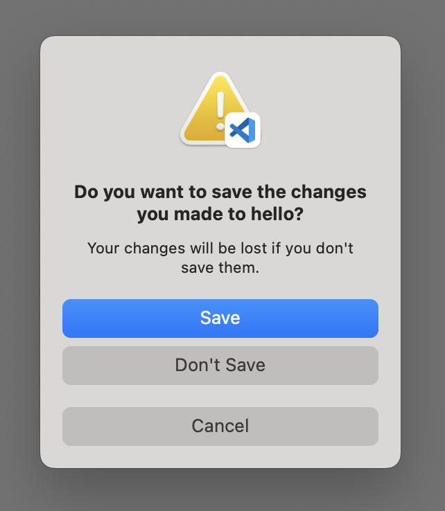
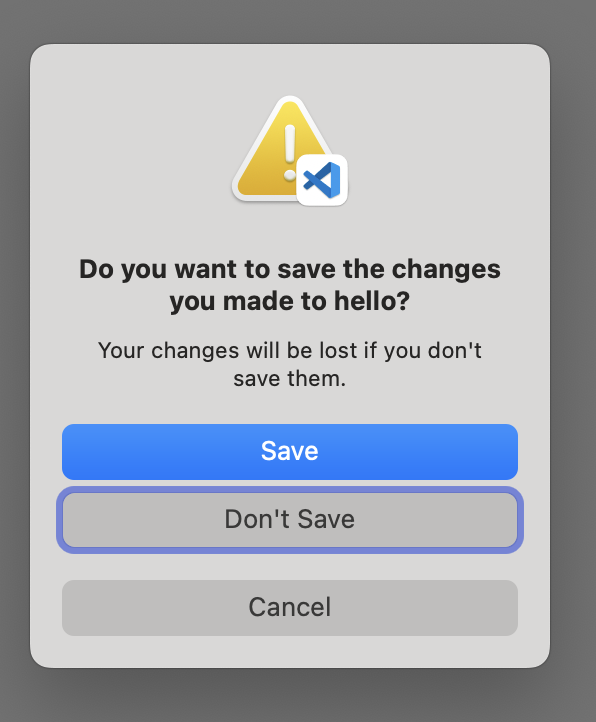

# 强迫症的 Mac 设置指南

## 如何配置一个高效的 Mac 工作环境

[English Version](https://github.com/macdao/ocds-guide-to-setting-up-mac/blob/master/README.en.md)

本文的最初版本写于 2015 年，那时候我用的是一台 2013 款的 MacBook Pro，操作系统刚升级到 OS X El Capitan 10.11。想要怀旧的可以点击 [2015 Version](https://github.com/macdao/ocds-guide-to-setting-up-mac/tree/2015)。

后来到了 2019 年，我拿到了 2019 款的 MacBook Pro，操作系统是 macOS Catalina 10.15。我特意没有从 Time Machine 恢复，而选择从头配置。当我按照本文配置时我发现，很多地方都变了。彼时的内容在 [2019 Version](https://github.com/macdao/ocds-guide-to-setting-up-mac/tree/2019)。

现在是 2024 年，我升级到了一台 M3 Max 的 MacBook Pro，操作系统是 macOS Sonoma 14。这次同样增加了很多内容。

## Table of Contents

可以点击 GitHub 右上角的菜单图标打开索引。

## Why this document

一直想写这么一篇文章，把我从同事那里学到的经验分享出来。市面上有很多类似的文章，写得都非常好，让我受益匪浅。不过我还是有一些自己总结出来的经验想要分享。

在工作中，我一般会在 1 到 10 人的团队中，经常会结对编程，即两个人共用一台 Mac 工作，因此也经常会把 Mac 外接一个大显示器、鼠标和键盘。我的常用开发平台有 Java、Ruby、Node.js、Web 等，使用 [JetBrains](https://www.jetbrains.com/) 的开发工具，比如 IntelliJ IDEA、RubyMine、WebStorm 等。

我深知自己的知识有限，所以写下本文以便和大家切磋交流。同时更有效率的方法和更好的工具也在不断涌现，我也贪心的希望把更好的方法和工具都收集更到到这里，我会不断更新本文，让它尽量不过时。最新内容请访问：<https://github.com/macdao/ocds-guide-to-setting-up-mac>。欢迎通过 GitHub 的`Issues`或者直接`Pull Requests`方式来分享你的经验。期待你的反馈。

我认为“一个高效的 Mac 工作环境”有以下几个特点：

- 自动化

  举个例子。手动安装一个应用，需要1)打开浏览器，2)搜索应用的名字，3)打开应用网站，4)寻找下载链接和安装方法，5)下载并等待下载完成，6)安装下载文件，7)可能还有后续的安装步骤。而自动化安装一个应用，只需要1)打开终端工具，2)敲入安装命令，3)等待完成这几个步骤。

  自动化可以大大简化操作，提高效率。

- 统一

  我经常结对编程，偶尔会遇到快捷键不一样，命令不同等问题。我强烈建议，至少在一个团队中，大家尽量使用相同的快捷键、命令等环境。（我记得有个实践就是这个，可是我一直没找到该实践的名字和出处，求告诉）

   同时，为了方便统一，我会优先考虑默认配置。只有当默认配置明显不如定制配置时，我才会采用定制配置。

- 够用

  够用就好，如果系统本身已经满足了我的需求，我不会再使用第三方工具。

- 效率

  效率，一切都是为了效率。

本文对于第三方应用如何安装和使用只有最简单的介绍，具体还请参考官方网站和相关文档。

部分章节标题标注 [OCD]，表示这些内容带有强烈的个人偏好。如果你有相似的偏好，欢迎参考；如果观点不同，请忽略。

PS：虽然本文名为“强迫症”，但其实并不是[真正意义上的强迫症](https://zh.wikipedia.org/wiki/强迫症)，真正意义上的强迫症是一种会对患者的日常生活产生负面影响的疾病。

## 1. macOS

本节介绍操作系统本身的一些设置。

### 设置 Trackpad 轻点来点按

默认情况下按下触摸板才是点按（click）。我喜欢设置成用轻点作为点按：

选择 [System Settings] > [Trackpad]，在 [Point & Click] 标签页中选中 [Tap to click]。

### 三指拖动

我习惯于三指拖动窗口。设置方法：选择 [System Settings] > [Accessibility] > [Pointer Control] > [Trackpad Options]，选中 [Use trackpad for dragging]，并且选择 [Dragging style] > [Three Finger Drag]。

设置完成后，还可以使用三指拖动的方式选择文本。

### 功能键

默认情况下，F1-F12 都是特殊功能，比如调节屏幕亮度。而当你需要键入 F1-F12 时（比如在使用 IntelliJ IDEA 的快捷键时），需要同时按住 Fn。这对于开发人员来说是非常不方便的。

把 F1-F12 改成标准功能键：选择 [System Settings] > [Keyboard] > [Keyboard Shortcuts] > [Function Keys]，选中 [Use F1, F2, etc. keys as standard function keys]。

PS：在带 Touch Bar 的机型上，这个设置貌似没有作用。

### 全键盘控制

当你在 Code 里关闭文件时，可能会遇到这样的对话框：



注意这个 [Save] 按钮跟其他两个按钮不太一样，它的底色是蓝的。这种按钮被称为默认按钮，除了用鼠标点击触发外，还可以通过回车键触发。

那么问题来了，如果你不想保存，想点击 [Don't Save]，是不是只能用鼠标点击了呢？其实有多种键盘操作方式：

1.  **开启全键盘控制**
    选择 [System Settings] > [Keyboard]，选中 [Keyboard navigation]。之后这个对话框会变成这样：
    
    这时 [Don't Save] 按钮有了一圈蓝边，意味着它成为了当前焦点，可以通过`空格键`触发。你还可以用`Tab`键在各个按钮间移动焦点。

2.  **使用特定快捷键**
    - `Command-Delete`：在包含“删除”或“不存储”按钮的对话框中，这个快捷键通常会直接触发该选项。
    - `Esc`：相当于点击 [Cancel] 按钮。

<details>
<summary>关于 Command-D 等快捷键的探索（个人吐槽）</summary>

除了上述两个办法之外，居然还有个方法！就是按`Command-D`！据说是因为按`Command-按钮的大写首字母`可以触发该按钮。可是！我按了`Command-C`和`Command-S`想取消和保存都没用！但是`Command-D`真的有用！如果仅仅是这也就算了，可是我又手贱试了下 TextEdit，在关闭未保存的文件时弹出的对话框上有三个按钮 [Delete]、[Cancel] 和 [Save]。然而`Command-D`和`Command-C`都没用，但是！`Command-S`可以保存！我完全不能理解！我整个人几乎都是崩溃的，只好以咆哮体写下这段文字。如果谁能解释请务必告诉我，必有重谢！

`Command-C`不能用应该是因为它绑定到了复制功能；而`Command-D`不能用因为它的作用是从“打开”对话框或“存储”对话框中选择“桌面”文件夹。
</details>

### 输入法快捷键

输入法我一直使用系统自带的拼音输入法。

由于 JetBrains 的 IDE，比如 IntelliJ IDEA、WebStorm 等都使用`Control-空格键`作为自动完成这个最常用功能的快捷键。这和输入法切换的快捷键冲突了。我不建议更改 IDE 的快捷键，因此我建议更改输入法的快捷键。而由于 macOS 已经默认使用`Caps Lock`键来切换输入法，这个非常方便，所以我建议将`Control-空格键`快捷键释放。

选择 [System Settings] > [Keyboard] > [Keyboard Shortcuts] > [Input Sources]，取消 [Select the previous input source] 和 [Select next source in input menu]。

最初我习惯使用`Caps Lock`切换输入法，但发现其有时不够灵敏。后来我发现将`Function key`设置为输入法切换键效果更佳。为保持使用习惯，我将`Caps Lock`按键映射为`Function key`，从而提高了切换的成功率。

首选让`Function key`来切换输入法：选择 [System Settings] > [Keyboard]，选择`Press 🌐 key to`为`Change Input Source`。

然后把`Caps Lock`按键映射成`Function key`：选择 [System Settings] > [Keyboard] > [Keyboard Shortcuts] > [Modifier keys]，选择`Caps Lock key`为`🌐 Globe`。

### 双拼输入法

从2020年2月，我开始使用双拼输入法，替代使用了多年的全拼输入法。和全拼（也就是最常见的“拼音输入法”）类似，双拼是一种基于拼音的，高效的输入法。它将拼音的声母和韵母分别映射到某个按键上，一个字只需要击键两次，一次声母，一次韵母。和全拼一样，主流的输入法软件都支持双拼。

想了解更多可以参考我写的文章[双拼：一天内就能掌握的高效拼音输入法](https://zhuanlan.zhihu.com/p/106941572)。

### 其他快捷键

让双手尽量多的键盘和快捷键，少使用鼠标和触摸板，可以大大提高效率。

- [Mac 键盘快捷键](https://support.apple.com/zh-cn/HT201236)

  苹果官方文档。当你在写代码，怎么通过快捷键让光标转移到行首、行尾、向上翻页或者将光标移左移一个词？都在这篇文档里。我常用的有上厕所锁屏：`Control-Command-Q`、在当前 App 的多个窗口间切换：``Command-重音符 (`)``。

- [Mac 上“终端”中的键盘快捷键](https://support.apple.com/zh-cn/guide/terminal/trmlshtcts/mac)

### 语音

macOS 自带了语音功能，可以用`say`命令让 Mac 开口说话：

```sh
say hello
```

可以和`&&`或者`;`配合使用来提示你某任务已经完成：

```sh
brew update && brew upgrade && brew cleanup ; say mission complete
```

通过命令行来听取发音还是有点麻烦。其实我们几乎可以在任何地方选中单词，然后使用快捷键`Option-Esc`发音。仅仅需要这样设置一下：选择 [System Settings] > [Accessibility] > [Spoken Content]，选中 [Speak selection]。

### 词典

macOS 自带了词典（Dictionary）。你几乎可以在任何应用中通过重按触摸板来现实对应单词的释义。如果你更喜欢三指轻拍触摸板，可以在 [System Settings] > [Trackpad]，在 [Point & Click] 标签页中选择 [Look up & data detectors] > [Tap with Three Fingers]。

也可以打开 Dictionary 应用来查找单词。

可以在 Dictionary 应用中添加英汉汉英词典。

### Dock Position

默认 Dock 在屏幕下方。我们的屏幕一般都是 16:10，Dock 在屏幕下方的话会占据本来就不大的垂直空间。建议把 Dock 放到右边或者左边。

选择 [System Settings] > [Desktop & Dock]，在 [Position on screen] 中选择不同的位置。我个人喜欢放在右侧。

### Keychain Access

钥匙串访问（Keychain Access）是一个 macOS 应用程序，对我来说它最大的功能就是查看已经保存的各种账号和密码，包括 Wi-Fi 密码。

PS：现在可以在 [System Settings] > [Wi-Fi] > [Advanced] 查看 Wi-Fi 密码，可以在 [System Settings] > [Passwords] 里查看保存的网站密码。

### 高效的光标

默认情况下，光标的闪烁速度和移动速度是相当慢的。当你需要用退格键删除大段文字的时候，会觉得痛不欲生，因为即使长按退格键，光标也移动的很缓慢。

调节光标移动速度：选择 [System Settings] > [Keyboard]，把 [Key repeat rate] 以及 [Delay until repeat] 的滑块拉到最右端，分别把持续连续输入和首次连续输入加快，从此享受飞一般的速度。

### Safari 打开上次会话的所有窗口

我经常在浏览器里打开多个窗口，这时候如果不小心关闭了（比如浏览器更新）那窗口就丢失了，非常影响工作。可以设置浏览器自动打开关闭前的所有窗口。选择 Safari 的 [Settings] >[General] > [Safari opens with] > [All windows from last session]。

### 查看充电功率

如果想知道当前的充电功率，可以使用如下命令：

```sh
system_profiler SPPowerDataType | grep Wattage -C 5
```

能看到如下内容：

```
    AC Charger Information:

      Connected: Yes
      ID: 0x0000
      Wattage (W): 60
      Family: 0xe000400a
      Charging: No
```

### Activity Monitor

Activity Monitor 默认的 Dock 图标是静态的，可以设置为显示 CPU 曲线，实时了解机器负载情况。

右键（双指）点击 Dock 上 Activity Monitor 的图标，选择 [Dock Icon] > [Show CPU History]。

### 在 Menu Bar 上显示日期

我喜欢让菜单栏上显示日期，这样可以方便的看到当天的日期。现在默认就是这样，不需要额外设置。设置的地方在 [System Settings] > [Control Center] > [Clock Options]。

### Spotlight 快捷键

Spotlight 的快捷键（不论是英文版还是中文版）都已经统一成了`Command-空格键`，此处没有什么修改建议。

### 创建大小写敏感的工作区

> **注意**：本节内容来自旧版指南，近期未经验证，可能已过时。

在多人合作的项目开发时，因为 Mac 文件系统默认是大小写不敏感的，所以经常会出现一些诡异的问题。创建一个大小写敏感的工作区（workspace）来解决避免这些问题：

```sh
hdiutil create -type SPARSE -fs 'Case-sensitive Journaled HFS+' -size 100g -volname workspace ~/Documents/workspace.dmg.sparseimage
```

可以通过三种方式挂载镜像：

- 直接双击打开`~/Documents/workspace.dmg.sparseimage`
- `open ~/Documents/workspace.dmg.sparseimage`
- `hdiutil attach ~/Documents/workspace.dmg.sparseimage`

### Remove all Dock icons [OCD]

默认情况下 Dock 被一堆系统自带的应用占据着，而其中大部分我都很少使用，当我打开几个常用应用后，Dock 上会有很多图标，每个图标都会被挤得很小。所以我会把所有 Dock 上固定的图标都删掉，这样一来 Dock 上只有我打开的应用。

PS：Finder 图标是删不掉的。

除了一个一个删除图标，也可以通过这个命令来删除所有的固定图标：

```sh
defaults write com.apple.dock static-only -bool true; killall Dock
```

PS：Dock 上的`Downloads`也会被隐藏掉。

如何恢复（之前只改变`static-only`的方法已经不生效了）：

```sh
defaults delete com.apple.dock; killall Dock
```

PS：使用这个方法会让所有的 Dock 配置重置，包括 Dock Position。

### 重置 Launchpad 上图标位置 [OCD]

新的应用被安装后，经常会跑到 Launchpad 的第一屏，所以它们的位置跟安装的顺序有关系，而我更希望它们可以按照某种更加稳定的顺序排列，比如按照系统默认的顺序：

```sh
defaults write com.apple.dock ResetLaunchPad -bool true; killall Dock
```

在默认顺序中，Launchpad 第一屏只有 Apple 自家应用。

在我更新到 macOS 15.2 以后，上面命令就失效了，我[找到](https://forums.macrumors.com/threads/macos-15-2-launchpad-default-layout.2445232/)了下面这个命令：

```sh
find 2>/dev/null /private/var/folders/ -type d -name com.apple.dock.launchpad -exec rm -rf {} +; killall Dock
```

这个命令查找目录`/private/var/folders/`下名为`com.apple.dock.launchpad`的文件夹，然后删除。

## 2. 常用工具

本节介绍一些常用的，跟开发没有直接关系的第三方应用及其设置。

### [Homebrew](http://brew.sh)

包管理工具，官方称之为`The missing package manager for macOS`。

官网的安装命令：

```sh
/bin/bash -c "$(curl -fsSL https://raw.githubusercontent.com/Homebrew/install/HEAD/install.sh)"
```

PS：安装 Homebrew 的时候会自动下载和安装 Apple 的 Command Line Tools。

安装完成后，Homebrew 建议你加入这样一句话到`~/.zprofile`中：`eval "$(${HOMEBREW_PREFIX}/bin/brew shellenv)`。而如果你使用了 [Oh My Zsh](#oh-my-zsh)，你可以直接使用`brew`插件来代替这一步。修改`~/.zshrc`，在`plugins=(git)`的括号中加上`brew`，例如`plugins=(git brew)`。

有了 Homebrew 以后，要下载工具，比如 Wget、Gradle、Maven 等工具，就不需要单独去网上下载了，只要一行命令就能搞定：

```sh
brew install wget gradle maven
```

执行`install`命令时常伴随更新，可能导致速度较慢。可通过设置环境变量`HOMEBREW_NO_AUTO_UPDATE`来关闭自动更新：

```sh
echo export HOMEBREW_NO_AUTO_UPDATE=1 >> ~/.zprofile
```

想知道世界上其他人喜欢使用哪些工具？可以在[这里](https://formulae.brew.sh/analytics/)查看到下载排名，看看哪些应用工具是最热门的。

Homebrew 的替代品有 [MacPorts](https://www.macports.org/)，我没有用过。

#### 使用国内镜像安装 Homebrew

有时候在国内访问 GitHub 非常慢，导致安装 Homebrew 总是失败。之前我提供过一个[方法](https://github.com/macdao/ocds-guide-to-setting-up-mac/tree/2019#%E4%BD%BF%E7%94%A8%E5%9B%BD%E5%86%85%E9%95%9C%E5%83%8F%E5%AE%89%E8%A3%85-homebrew)，不过现在 Homebrew 已经支持[使用国内的源安装](https://docs.brew.sh/Installation#git-remote-mirroring)。

```sh
export HOMEBREW_BREW_GIT_REMOTE="https://mirrors.ustc.edu.cn/brew.git"
export HOMEBREW_CORE_GIT_REMOTE="https://mirrors.ustc.edu.cn/homebrew-core.git"
export HOMEBREW_BOTTLE_DOMAIN="https://mirrors.ustc.edu.cn/homebrew-bottles"
/bin/bash -c "$(curl -fsSL https://mirrors.ustc.edu.cn/misc/brew-install.sh)"
```

其中`HOMEBREW_BOTTLE_DOMAIN`的设置可以让安装过程中的`ruby`下载使用镜像。参考[Homebrew 源使用帮助](https://mirrors.ustc.edu.cn/help/brew.git.html)。

然后为了让镜像持续生效，请把以下内容添加到`~/.zprofile`文件中。

```sh
export HOMEBREW_BREW_GIT_REMOTE="https://mirrors.ustc.edu.cn/brew.git"
export HOMEBREW_CORE_GIT_REMOTE="https://mirrors.ustc.edu.cn/homebrew-core.git"
export HOMEBREW_BOTTLE_DOMAIN="https://mirrors.ustc.edu.cn/homebrew-bottles"
export HOMEBREW_API_DOMAIN="https://mirrors.ustc.edu.cn/homebrew-bottles/api"
```

其中`HOMEBREW_API_DOMAIN`会把包安装信息的地址设置成镜像地址。具体参考 [brew(1)](https://docs.brew.sh/Manpage)、[4.0.0](https://brew.sh/2023/02/16/homebrew-4.0.0/)。

### [Homebrew Cask](https://github.com/Homebrew/homebrew-cask)

Homebrew Cask 允许你使用命令行安装 macOS 应用。比如你可以这样安装 Chrome：`brew install --cask google-chrome`。还有 Evernote `evernote`、Sublime Text `sublime-text`、VirtualBox `virtualbox`、Docker `docker`、Firefox `firefox`、Visual Studio Code `visual-studio-code` 等都可以用 Homebrew Cask 安装。

Homebrew Cask 是社区驱动的，如果你发现 Homebrew Cask 上的应用不是最新版本，或者缺少你某个应用，你可以自己提交 pull request。

目前 Homebrew Cask 已经和 Homebrew 深度集成，不需要单独安装了。

应用也可以通过 App Store 安装，而且有些应用只能通过 App Store 安装，比如 Xcode 等一些 Apple 的应用。App Store 没有对应的命令行工具，并且还需要 Apple ID，相对有些麻烦，倒是更新起来很方便。

几乎所有常用应用均可通过 Homebrew Cask 安装，且通常从官方渠道下载。因此，建议在安装新应用时优先考虑 Homebrew Cask。若不确定应用 ID，可使用`brew search`命令搜索。

#### 使用国内镜像安装 Homebrew Cask

根据上文[使用国内镜像安装 Homebrew](#使用国内镜像安装-homebrew) 讲的方式设置后，Cask 也可以使用镜像。

### [iTerm2](https://iterm2.com/)

iTerm2 是最常用的终端应用，是 Terminal 应用的替代品。提供了诸如`Split Panes`等[一群实用特性](https://iterm2.com/features.html)。它默认的黑色背景让我毫不犹豫的抛弃了 Terminal。

安装：

```sh
brew install --cask iterm2
```

感谢 Homebrew Cask，我们可以通过命令行自动安装 iTerm2 了。

至此，Terminal 应用已完成其使命，后续命令行操作将由 iTerm2 接管。

在终端里，除了可以用`Control-E`等快捷键（详见[其他快捷键](#其他快捷键)）之外，还可以使用`Option-B`、`Option-F`等快捷键（具体可以参考[这里](http://ss64.com/bash/syntax-keyboard.html)）。前提是这样设置一下：

选择 [Settings] > [Profiles]，选择你在使用的 Profile（默认是`Default`），在 [Keys] 标签页中把 [Left Option key:] 和 [Right Option key:] 都设置成 [Esc+]。

每次打开新窗口/标签页时，默认进入`$HOME`目录。若希望新打开的标签页或窗口自动进入当前标签页所在的目录，可进行如下设置：

选择 [Settings] > [Profiles]，选择你在使用的 Profile（默认是Default），在 [General] 标签页中的选择 [Working Directory] > [Reuse previous session's directory]。

在 iTerm2 中双击会自动选中对应的词，三击会选中对应的整行。选中的内容会自动进入剪贴板，不需要再按`Command-C`复制。

我经常使用 iTerm2 自带的密码管理工具管理一些终端用到的密码。在 iTerm2 的 [Window] > [Password Manager]（或者快捷键`Command-Option-F`）打开。

Timestamps 功能，可以在终端里显示每行输出的时间。一次性使用：[View] > [Show Timestamps]，默认使用：[Settings] > [Profiles] > [Session] > [Show timestamps] -> [Always]。

### [Oh My Zsh](http://ohmyz.sh)

默认的 Bash （Catalina 已经默认使用 Zsh）是黑白的，没有色彩。而 Oh My Zsh 可以带你进入彩色时代。Oh My Zsh 同时提供一套插件和工具，可以简化命令行操作。后面我们会看到很多介绍，你会看到我爱死这家伙了。

官网的安装命令：

```sh
sh -c "$(curl -fsSL https://raw.githubusercontent.com/ohmyzsh/ohmyzsh/master/tools/install.sh)"
```

对于国内用户可以使用[如下方法](https://github.com/ohmyzsh/ohmyzsh/wiki#welcome-to-oh-my-zsh)：

```sh
sh -c "$(curl -fsSL https://install.ohmyz.sh)"
```

目前我使用的插件有：`git z history brew asdf`

Oh My Zsh 使用了 Z shell（Zsh），一个和 Bash 相似的 Shell，而非 Bash。

Oh My Zsh 还有很多[有价值的插件](https://github.com/robbyrussell/oh-my-zsh/wiki/Plugins-Overview)。

替代品有基于 [fish shell](https://fishshell.com/) 的 [Oh My Fish](https://github.com/oh-my-fish/oh-my-fish)，基于 Bash 的 [Oh My Bash](https://github.com/ohmybash/oh-my-bash)。

### 命令补全

Z shell 支持命令补全，而 Oh My Zsh 会默认启用它。现在你在终端里里键入`curl -`然后按`Tab`键，就可以看到各种候选参数：

```
--data         -d  -- HTTP POST data
--fail         -f  -- Fail fast with no output on HTTP errors
...
```

再次按下`Tab`键还可以通过方向键选择参数。

我们通过 Homebrew 查看工具的信息时，例如`brew info colima`：

```
==> Caveats
zsh completions have been installed to:
  /usr/local/share/zsh/site-functions
...
```

说明这个工具自带了命令补全配置，通过 Homebrew 安装后就可以直接使用了。例如在终端里里键入`colima `然后按`Tab`键，就可以看到各种候选参数：

```
completion  -- Generate completion script
delete      -- delete and teardown Colima
...
```

然而，如果你使用的是 Apple silicon 电脑，那么这样还不行。具体参考 [brew Shell Completion](https://docs.brew.sh/Shell-Completion)。简而言之，Z shell 通过`compinit`命令来启用命令补全，`compinit`会遍历`$fpath`变量里的目录，加载其中的命令补全配置。对于 Intel 电脑， Homebrew 会把命令补全配置安装到`/usr/local/share/zsh/site-functions`目录中，这也是 Z shell 默认的`$fpath`。但是对于 Apple silicon 电脑， Homebrew 的目录变成了`/opt/homebrew/share/zsh/site-functions`，所以需要我们自己配置一下，把以下内容添加到`~/.zprofile`文件里：

```sh
FPATH="/opt/homebrew/share/zsh/site-functions:${FPATH}"
```

许多文章推荐使用 [zsh-completions](https://github.com/zsh-users/zsh-completions)，但它并非命令补全的必需组件。该仓库包含了 Homebrew 未自带的常用命令补全配置（如`mvn`、`yarn`），若有需求可自行安装。

### Git 常用别名

为提高效率，许多人会使用 Git 别名，例如用`git st`代替`git status`。然而，这通常需要手动设置，且各人配置不尽相同。

Oh My Zsh 提供了一套系统别名（alias）以实现相同功能，例如`gst`是`git status`的别名。Git 插件默认启用，这意味着使用 Oh My Zsh 即可获得一套高效且通用的别名。以下是一些我常用的别名：

Alias | Command
----- | -------
gapa  | `git add --patch`
gc!   | `git commit --verbose --amend`
gcl   | `git clone --recurse-submodules`
gclean| `git clean --interactive -d`
gcm   | `git checkout $(git_main_branch)`
gcmsg | `git commit --message`
gco   | `git checkout`
gd    | `git diff`
gdca  | `git diff --cached`
glola | `git log --graph --pretty="%Cred%h%Creset -%C(auto)%d%Creset %s %Cgreen(%ar) %C(bold blue)<%an>%Creset" --all`
gp    | `git push`
grbc  | `git rebase --continue`
gst   | `git status`
gpr   | `git pull --rebase`
gwip  | `git add -A; git rm $(git ls-files --deleted) 2> /dev/null; git commit --no-verify --no-gpg-sign --message "--wip-- [skip ci]"`

完整列表请参考：<https://github.com/ohmyzsh/ohmyzsh/tree/master/plugins/git/>。

### [历史] ShiftIt

> **Note**: 此工具已不再维护，在较新版 macOS 12+ 上已无法工作。现推荐使用 [Hammerspoon ShiftIt](#hammerspoon-shiftit) 作为替代。

原生 macOS 仅支持手动调整窗口大小，因此需要窗口管理工具。ShiftIt 是曾经流行的窗口管理工具之一。

替代者有 SizeUp，主要快捷键和 ShiftIt 相同。

当然如果喜欢 hacking，[Slate](https://github.com/jigish/slate)  是个不错的 hackable 的窗口管理工具。配置可以参照 <http://thume.ca/howto/2012/11/19/using-slate/>。

还有就是 [Rectangle](https://rectangleapp.com/)，它在 Homebrew 排行榜上排名较高，但需注意其默认快捷键与 [IntelliJ IDEA](https://resources.jetbrains.com/storage/products/intellij-idea/docs/IntelliJIDEA_ReferenceCard.pdf) 存在冲突。

### [Hammerspoon ShiftIt](https://github.com/peterklijn/hammerspoon-shiftit)

一个基于 [Hammerspoon](https://www.hammerspoon.org/)，模拟 Shiftit 窗口管理功能的方法，是目前推荐的窗口管理方案。安装步骤稍显繁琐，具体方法见标题链接。

如果 [Step 2](https://github.com/peterklijn/hammerspoon-shiftit?tab=readme-ov-file#step-2) 中的`ShiftIt spoon`无法下载，可以使用[链接](https://github.com/peterklijn/hammerspoon-shiftit/releases/download/v1.1/ShiftIt.spoon.zip)，文件是一模一样的。

### z

打开终端后，如何快速进入项目工作目录？除了`cd xxx`、`Control-R`或使用别名，还有更便捷的方式。

[z](https://github.com/rupa/z) 工具可以帮你快速进入目录。比如在我的 Mac 上运行`z cask`就会进入`/usr/local/Homebrew/Library/Taps/homebrew/homebrew-cask`目录。

该工具安装简便，无需额外下载，因为它已整合在 Oh My Zsh 中。只需编辑`~/.zshrc`文件，在`plugins=(git)`一行中添加`z`（例如`plugins=(git z)`），然后运行`source ~/.zshrc`重新加载配置文件即可使用。

替代品有 autojump。autojump 需要使用 Homebrew 安装。

### [Vimium](https://vimium.github.io/)

Vimium 是一款浏览器扩展，支持纯键盘操作，能显著提升浏览器使用效率。

安装方法请参考官方网站。支持 Chrome、Edge、Firefox。

### 安装字体

我经常会使用一些开源字体，比如`Open Sans`。之前我会从网上寻找并下载字体，后来使用 [SkyFonts](https://www.monotype.com/products/skyfonts) 安装字体，直到我发现了 [homebrew-cask-fonts](https://github.com/Homebrew/homebrew-cask-fonts)：

```sh
brew tap homebrew/cask-fonts
brew install font-open-sans
```

### 电池充电管理

> **Note**: 此前推荐的 `bclm` 工具在较新的 macOS 版本上已无法使用。

我看到一个研究，说是相比于「放电到 25% 再充电，然后充电到 100%」，「放电到 45% 再充电到 75%」会让电池会有更长的寿命（健康度）。参考[几个月电池健康掉到90%？这样充电电池寿命延长3倍（非标题党）](https://www.bilibili.com/video/BV1Ha411F7rg/?share_source=copy_web)。

为了延长电池寿命，将充电上限设置为 80% 左右是一个有效方法。目前推荐使用 [batt](https://github.com/charlie0129/batt) 这个命令行工具。

```sh
brew install batt
```
安装后需要通过 `sudo brew services start batt` 启动服务。

对于喜欢图形化界面的用户，[AlDente](https://apphousekitchen.com/) 是一个功能更强大的替代品。有个槽点是，AlDente 会占用我的 Menu Bar，让我的刘海 MacBook Pro 的 Menu Bar 空间更加拙荆见肘。

### [totp-cli](https://github.com/yitsushi/totp-cli)

我经常需要输入一些 2FA 的验证码，这需要打开手机 App 复制 6 位的数字。如果可以直接在笔记本上直接完成，那么就会方便许多。

`totp-cli`是一款在电脑上运行的 TOTP 工具，可以通过命令行生成验证码。除此之外，他还可以加密保存密钥、管理多组密钥以及导入导出。之前我使用的是`oathtool`，自己管理密钥（我放到了 Keychain 里），还要写脚本。现在我已经换成了`totp-cli`。

```sh
brew install totp-cli
```

### Visual Studio Code

我现在使用 Visual Studio Code 更多一些。Visual Studio Code 同样也有 Homebrew Cask 自动建立`code`链接，也有 Oh My Zsh 插件支持。

```sh
brew install --cask visual-studio-code
```

### Sublime Text 3

> **注意**：本节内容来自旧版指南，近期未经验证，可能已过时。

安装：

```sh
brew install --cask sublime-text
```

在命令行中指定使用 Sublime Text 打开某文件，是一个非常常用的功能，一般我们会按照 [OS X Command Line](https://www.sublimetext.com/docs/3/osx_command_line.html) 中所说执行 `ln -s "/Applications/Sublime Text.app/Contents/SharedSupport/bin/subl" ~/bin/subl` 来增加`subl`链接。但是如果你用 Homebrew Cask 安装的话，恭喜你，你不需要运行这个命令，因为 Homebrew Cask 自动帮你做了这件事情。而且你卸载 Sublime Text 的时候 Homebrew Cask 会自动删掉这个链接。

同时 Oh My Zsh 也提供了 Sublime Text 插件，叫做`sublime`。参考：<https://github.com/ohmyzsh/ohmyzsh/wiki/Plugins#sublime>，这个插件和通过 Homebrew Cask 安装的 Sublime Text 完美兼容。

替代品有 Atom、TextMate、Sublime Text 2 等，跟 Sublime Text 3 一样，用 Homebrew Cask 安装的话命令行工具会被自动加入`$PATH`。

### MacDown

MacDown 是 Markdown 编辑器。由于 Mou 一直不支持代码高亮，我就转向了 MacDown。完美支持 [GFM](https://help.github.com/articles/github-flavored-markdown/)。

我特别喜欢 [Markdown](https://daringfireball.net/projects/markdown/)，我用 Makdown 来写文章（包括本文），写幻灯片（[reveal.js](https://github.com/hakimel/reveal.js/)）。Markdown 可以让我专注于内容本身，而无需花精力在排版和样式上。

安装：

```sh
brew install --cask macdown
```

Homebrew Cask 还会增加`macdown`命令，可以在命令行方便的使用 MacDown 打开文件。

### Scroll Reverser

> **注意**：本节内容来自旧版指南，近期未经验证，可能已过时。

当你在浏览一个很长的网页时，你看完了当前显示的内容，想要看后续的内容，你可以在 Trackpad 上双指上滑，或者鼠标滚轮向上滚动。这是被称作“自然”的滚动方向。

然而在 Windows 里鼠标滚动的行为是相反的：鼠标滚轮向下滚动才会让浏览器显示后续的内容，向上滚动会达到页面的顶部。你可以在 macOS 的系统偏好设置里修改（选择 [System Settings] > [Trackpad]，在 [Scroll & Zoom] 标签页中取消 [Natural scrolling]），但是这样会同时改变 Trackpad 的方向。

要想只改变鼠标滚轮的方向，而保持 Trackpad 依旧是“自然”的，我们需要 Scroll Reverser：

```sh
brew install --cask scroll-reverser
```

PS：这货会让三指点击失效。

### [LastPass](https://lastpass.com)

> **注意**：本节内容来自旧版指南，近期未经验证，可能已过时。

LastPass 是管理密码的工具，支持二次验证，提供所有浏览器插件以及 Mac 桌面版本。

最重要的是，它提供命令行的版本，可以直接通过 Homebrew 安装：

```sh
brew install lastpass-cli --with-pinentry
```

之后，只需要命令：

```sh
lpass login you@email.com
```

就可以拷贝密码或者集成到其他命令中了：

```sh
lpass show --password gmail.com -c
```

### [SourceTree](https://www.sourcetreeapp.com/)

> **注意**：本节内容来自旧版指南，近期未经验证，可能已过时。

SourceTree 是 Atlassian 公司出品的一款优秀的 Git 图形化客户端。如果你发现命令行无法满足你的要求，可以试试 SourceTree。

安装：

```sh
brew install --cask sourcetree
```

用 Homebrew Cask 安装会自动增加命令行工具`stree`到`$PATH`里。在命令行中输入`stree`可以快速用 SourceTree 打开当前 Git 仓库。详细用法请参见`stree --help`。

### [CheatSheet](http://www.mediaatelier.com/CheatSheet/)

> **注意**：本节内容来自旧版指南，近期未经验证，可能已过时。

CheatSheet 能够显示当前程序的快捷键列表，默认的快捷键是长按`Command`。

安装：

```sh
brew install --cask cheatsheet
```

### [Alfred](https://www.alfredapp.com)

> **注意**：本节内容来自旧版指南，近期未经验证，可能已过时。

Mac 用户不用鼠标键盘的必备神器，配合大量 Workflows，习惯之后可以大大减少操作时间。

安装：

```sh
brew install --cask alfred
```

### [Stow](http.www.gnu.org/software/stow/)

> **注意**：本节内容来自旧版指南，近期未经验证，可能已过时。

GNU Stow 是管理符号链接（symlink）的一个小公举。主要用于 symlink 你的 [dotfiles](http://dotfiles.github.io/) 如 Emacs、Git、fish shell/Zsh 的配置文件。安装只需要：

```sh
brew install stow
```

安装了 stow 之后，我们可以开始 symlink 一些 dotfiles 了。完整使用 stow 和 dotfiles 的流程可以参考 <https://github.com/jcouyang/dotfiles>。

当你的 dotfiles 都妥妥的 symlink 到 `~/dotfiles` 后，push 到 GitHub 上就再也不怕换电脑了。

## 3. 开发工具

### [asdf-vm](https://asdf-vm.com)

asdf-vm 是一个命令行工具，它可以让你同时安装多个版本的开发工具，版本间可以随时切换，还可以基于全局、目录、和当前 shell session 配置不同的版本。它以插件的形式支持开发工具，目前支持 .NET Core、Clojure、Deno、Groovy、Java、Kotlin、Maven、MySQL、Node.js、PHP、Python、Ruby、Scala、Yarn 等近 200 个，具体参见[插件列表](https://github.com/asdf-vm/asdf-plugins)。有了 asdf-vm，你就不再需要另外安装`gvm`、`nvm`、`rbenv`和`pyenv`等工具了。

我现在使用 asdf-vm 来管理我使用的开发工具，包括 Java、Node.js、Gradle、Maven。

```sh
brew install asdf
```

可以使用前缀的方式来安装最新稳定版本：

```sh
asdf plugin add java
asdf install java latest:temurin-21
```

asdf-vm 还需要对环境变量`PATH`做一些[更改](https://asdf-vm.com/guide/getting-started.html#_3-install-asdf)。幸好还有[`asdf for oh-my-zsh`插件](https://github.com/ohmyzsh/ohmyzsh/blob/master/plugins/asdf/asdf.plugin.zsh)，可以帮助完成设置。

需要注意的是，这个插件依赖于 Homebrew，所以在插件配置时需要把`brew`放在`asdf`前面，例如：

```
plugins=(git z history brew asdf gradle)
```

使用 asdf-vm 安装的工具的[命令补全](#命令补全)可能会有问题。每个命令的补全配置需要额外安装，使用 Homebrew 往往会自动安装补全配置。另外 Oh My Zsh 也可能带了补全配置，例如 [Gradle](https://github.com/gradle/gradle-completion)。

替代品有 [SDKMAN!](https://sdkman.io)。

### Java

macOS 都不会自带 JDK 了，所以进行 Java 开发的话，需要下载 JDK。在 Homebrew Cask 之前，我们需要从 <https://developer.apple.com/downloads/> 或者 Oracle 网站上下载。还有更麻烦的－－卸载 JDK 和升级 JDK。

JDK 安装文件是 pkg 格式，卸载和`.app`不一样，且没有自动卸载方式。

现在我推荐使用 [asdf-java](https://github.com/halcyon/asdf-java) 来管理 Java 版本。也可以通过 `brew install openjdk@17` 或者 `brew install --cask temurin` 直接安装 JDK。

替代品有 [jEnv](https://github.com/jenv/jenv)。

#### 国内使用

因为通过`asdf-java`的时候要访问`raw.githubusercontent.com`，所以一些命令可能会失败。可以运行以下命令来避免。

对于 Intel 电脑：

```sh
cp ~/.asdf/plugins/java/data/jdk-macosx-x86_64-ga.tsv $TMPDIR/asdf-java-$(whoami).cache/releases-macosx-x86_64.tsv
```

Apple silicon 电脑：

```sh
cp ~/.asdf/plugins/java/data/jdk-macosx-aarch64-ga.tsv $TMPDIR/asdf-java-$(whoami).cache/releases-macosx-aarch64.tsv
```

在 macOS 上，有些应用会通过命令`/usr/libexec/java_home`来使用 JDK。对此，`asdf-java`也提供了[解决方案](https://github.com/halcyon/asdf-java#java_home-integration)。

### 民间使用的 Java 版本切换方法

添加以下脚本到当前 shell 配置文件中：`~/.zprofile`或者`~/.bash_profile`。

```sh
function setjdk() {
    export JAVA_HOME=`/usr/libexec/java_home -v $@`
}
```
这样我们就可以通过输入一条命令进行版本切换了：

```sh
setjdk 1.8
```

### IntelliJ IDEA

Java 开发必备工具 IntelliJ IDEA。可以安装 Ultimate Edition：

```sh
brew install --cask intellij-idea
```

也可以安装开源免费的 Community Edition：

```sh
brew install --cask intellij-idea-ce
```

由于[IntelliJ IDEA 迁移到统一发行版](https://blog.jetbrains.com/zh-hans/idea/2025/07/intellij-idea-unified-distribution-plan/)，IDEA将统一 Ultimate 和 Community Edition，名称统一成 IntelliJ IDEA。所以自从2025.2以后，只需要安装 Ultimate Edition 就可以了。如果你没有付费的 License 的话，依然可以使用 Community Edition 对应的功能。

IntelliJ IDEA 有几套内建的快捷键方案（Keymap）。其中我比较常用的有`macOS`和`IntelliJ IDEA Classic`两种。区别是:

- `macOS`更加符合 macOS 常用的快捷键
- `IntelliJ IDEA Classic`方案和其他平台上的快捷键类似

一个团队使用不同的快捷键会影响效率。可以用 [View] > [Quick Switch Scheme] > [4 Keymap] 快速切换 Keymap。

之前我经常会在 macOS 和 Windows 平台上使用 IDEA，所以我一般使用`IntelliJ IDEA Classic`方案。最近我都使用默认的`macOS`方案。

可以从 IDEA 的 [Help] > [Keyboard Shortcuts PDF] 打开快捷键的参考手册。

IntelliJ IDEA 默认的`Jetbrains Mono`字体支持字体连笔（font ligatures），非常酷。设置方法：[Settings] > [Editor] > [Font]，选中 [Enable ligatures]。

### Docker

开发中经常需要用到 Docker。因为 Docker Desktop 不再免费，我开始使用 [Colima](https://github.com/abiosoft/colima)和[Podman](https://zhuanlan.zhihu.com/p/22886116297)。

```sh
brew install docker colima
```

### [PlantUML](https://plantuml.com/)

开发中经常需要画图。我的很多同事会用 draw.io 一类的工具来画图，然而我更喜欢基于纯文本的格式，例如 Markdown 来写文档、用 reveal.js 做幻灯片、用 PlantUML 画架构图和类图。使用纯文本，可以方便的比较差异，可以方便的合并，也更加开放可以选择不同的工具。

我之前会使用 [Graph-Easy](https://github.com/ironcamel/Graph-Easy)，而现在会使用 PlantUML。 PlantUML 有着繁荣的开放生态。[C4 model](https://c4model.com) 已经集成到[标准库](https://plantuml.com/stdlib)中。

IntelliJ IDEA、[Visual Studio Code](https://marketplace.visualstudio.com/items?itemName=jebbs.plantuml) 都有插件支持。Visual Studio Code 还可以在 [Markdown 里嵌入 PlantUML](https://marketplace.visualstudio.com/items?itemName=jebbs.plantuml#markdown-integrating)。

除了 [GraphViz](https://plantuml.com/graphviz-dot)，PlantUML 还支持了其他布局引擎，包括基于 Java 的 [Smetana](https://plantuml.com/smetana02)、[Eclipse Layout Kernel / ELK](https://plantuml.com/elk)。由于 ELK 会用折线来绘制连线，所以布局上会比 GraphViz 和 Smetana 更加清晰一些，所以我最近会更多的使用 ELK。

我喜欢在[本地运行](https://plantuml.com/server)，相比于官方的服务，本地运行可以使用更好的中文字体。我使用的是 [PlantUML PicoWeb Server](https://plantuml.com/picoweb) 方法，可以方便的加入 ELK。

### [rbenv](https://github.com/rbenv/rbenv)

> 已经使用 asdf-vm 替代

> 未验证

人人都需要一个 Ruby 版本管理工具。rbenv 就是这样一个轻量级工具，它可以通过 Homebrew 安装。

安装：

```sh
brew install rbenv ruby-build
```

然后在`~/.zshrc`中加上`rbenv`插件，否则你需要手动添加`eval "$(rbenv init -)"`到`~/zshrc`或者`~/.zprofile`文件里。

有时候项目会依赖一些奇怪的版本号，比如`ruby-2.1.0`，这个时候你需要 [rbenv-aliases](https://github.com/tpope/rbenv-aliases) 帮忙：

```sh
brew install rbenv-aliases
```

替代品有 RVM、chruby。因为 RVM 不能通过 Homebrew 安装，并且安装的时候会没有节操的修改一堆文件，所以被我早早的弃用了。chruby 也是一个轻量级工具，而且可以完美的和 Oh My Zsh 集成在一起，我看到有些生产环境在用它。

### Ruby 常用别名

> unverified

几乎所有 Ruby 开发人员都会把`bi`作为`bundle install`的别名。Oh My Zsh 提供`builder`插件，这个插件提供了一套别名，比如`bi`、`be`。同时还能让你在运行一些常用 gem 的时候直接输入`rspec`，不需要`be rspec`这样了。具体包括哪些命令请参考[这里](https://github.com/ohmyzsh/ohmyzsh/tree/master/plugins/bundler)。

Zsh 对于`[`和`]`符号有特殊的处理，所以在运行`rake task[parameter]`的时候会报错，你需要改成`rake task\[parameter\]`或者`noglob rake task[parameter]`。然而 Oh My Zsh 已经看穿这一切，自带的 rake 插件已经解决了这个问题：`brake task[parameter]`。

添加插件的时候注意把`rake`放到`bundler`后面，例如这样：

```
plugins=(git z sublime history rbenv bundler rake)
```

### Node 版本管理

> 已经使用 asdf-vm 替代

> 未验证

Node 的版本管理工具有很多，常用的会有以下几个：

* [nodenv](https://github.com/nodenv/nodenv)

  该工具是一个类似 rbenv 的工具，命令和其完全一样，安装和配置也一样。

  ```
  brew install nodenv
  ```

  你需要手动添加以下配置到`~/.zshrc`或者`~/.zprofile`文件里。

  ```sh
  export PATH="$HOME/.nodenv/bin:$PATH"
  eval "$(nodenv init -)"
  ```

* [nvm](https://github.com/creationix/nvm)

  该工具是一个类似 RVM 的工具，命令安装方式也基本一样，可以参考官方文档。

* [n](https://github.com/tj/n)

  一个简单的工具，安装方式类似 nvm，无需额外配置。具体参考官方文档。

目前根据 GitHub Stars，这三个管理工具的排名依次是 nvm、n、nodenv。但是个人建议采用 nodenv，原因同 rbenv，尤其已经在使用 rbenv 的伙伴们会觉得 nodenv 更顺手 :smile: 。

### Java [OCD]

作为一个强迫症患者，每当我看到 Java 的错误写法就想纠正过来。

当指编程语言时，Java 的正确写法是首字母大写，其余小写。其他写法比如`JAVA`、`java`都是不对的。

在其他一些地方会使用小写的`java`：

- `java`命令
- 原文件`Main.java`
- 包名`java.lang`

只有在全大写的标题里使用`JAVA`或者环境变量`JAVA_HOME`。

## 参考资料

- [Hacker's Guide to Setting up Your Mac](https://github.com/lapwinglabs/blog/blob/master/hacker-guide-to-setting-up-your-mac.md)
- [Setting up a new (OS X) development machine](https://mattstauffer.co/blog/setting-up-a-new-os-x-development-machine-part-1-core-files-and-custom-shell)
- [高效 MacBook 工作环境配置](http://www.xialeizhou.com/?p=71)（已失效）
- [程序员如何优雅地使用 Mac？](http://www.zhihu.com/question/20873070)
- [装点你的 Dock：外观篇](http://sspai.com/33493)
- [6 Dock Terminal tweaks Mac users need](https://www.computerworld.com/article/3040996/6-dock-terminal-tweaks-mac-users-need.html)
